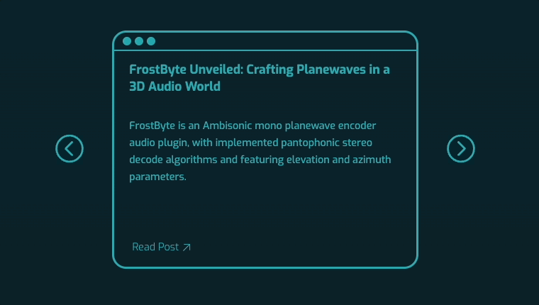
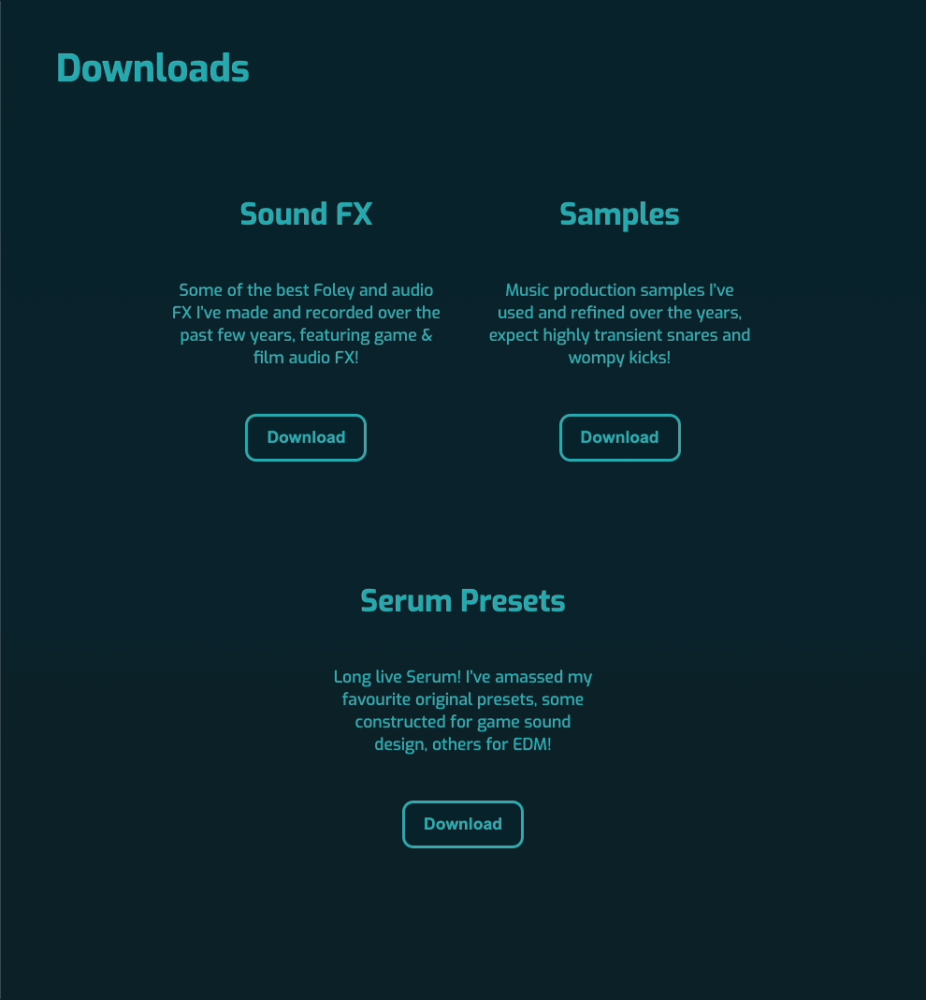

# Music Blog Website 🎹

A Gatsby project designed in Figma, hosted and deployed with Netlify, and handling form data with Netlify Forms.

- [Figma Design]()
- [Deployed Website]()

## Technology Stack

For this project I used:

- HTML
- CSS
- Javascript
- React
- Gatsby
- Netlify
- Netlify Forms

## Introduction

With this portfolio project, I not only wanted to showcase my proficiency in more involved front-end technologies such as React and Gatsby, but also share my passion for music technology. The project showcases how I would, with my current front-end development skills, create a blog website for a music producer (in this case myself), and also have it serve as a hub for their content creation and music releases.

## Features

### Card Carousel

An interactive feature on the homepage which cycles through React card components in an infinite loop:

### Download Modal

A pop-up window that requires email input and a checked marketing checkbox to download content (the email, being subsequently handled by Netlify Forms, and materials subsequently downloaded sourced from my music production work):

### Responsive Navigation

A navigation menu bar that collapses to the music producer's logo for smaller screen sizes, providing a drop-down menu:

### Accessibility

- **ARIA Attributes:** Utilized `aria-label` to provide accessible names for elements, particularly those inserted with CSS as background images.
- **Keyboard Navigation:** Ensured all interactive elements are keyboard-navigable and visible focus indicators are provided.

### Styling Details

Styling the window control buttons for the carousel cards, using the MacOS colour scheme, and colour coding their functionality:

Maintaining a consistent styling theme which squares rounded corners upon hover, this can be seen for buttons, the carousel cards and the download modal.

## Design

The design process for this project involved looking at the aesthetic already established by Plux, my music producer alias, and looking at personal blog sites for layout and styling inspiration. Here were two sites in particular that inspired my designs:

- [Not a Number](https://www.nan.fyi/)
- [Cassie Codes](https://www.cassie.codes/)

I then created a Figma design file using auto-layout to outline a desktop layout, and a mobile layout for both the homepage and the blog post pages for the project.All images featured on the homepage are AI generated, using [Leonardo.Ai](https://leonardo.ai/), a free AI image generation service. This allowed me to obtain high-resolution images that matched the same aesthetic and colour scheme I wanted without extensive photo editing.

## Challenges

There were a few points during the development of this project that challenged me to think creatively and develop my understanding:

- Creating reusable components: Developed strategies for creating reusable components, like passing CSS directly as props, which facilitated maintaining the same card carousel components between different sections (Blog and Music) with varying content and styles.
- Generalizing CSS rules: Developed flexible CSS rules for a single CSS module that could robustly interpret varied blog content and assure reliable responsive behaviors across blog post pages.

## What This Project Taught Me

There was also much practical experience gained from this project:

- A deeper understanding of React practices such as: abstracting code into components, handling state using the useState React Hook and passing content between components using props.
- Organising and managing source code files, CSS modules, assets and directory structures in a more component-heavy Gatsby project.
- Creating more complex, multi-step animations with the CSS animation property for button and link hover interactions.
