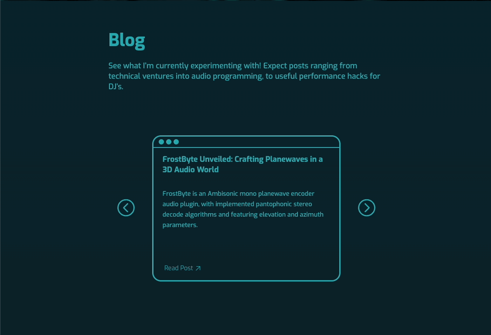

# Music Blog Website 🎹

A Gatsby project designed in Figma, hosted and deployed with Netlify, and handling form data with Netlify Forms.

- [Figma Design](https://www.figma.com/file/ASmcVwkDMcHRnhblKE3Cgt/Music-Blog-Website?type=design&mode=design&t=EknlmpvGS189ihWz-1)
- [Deployed Website](https://plux-music-blog-demo.netlify.app/)

## Technology Stack

For this project I used:

- HTML
- CSS
- Javascript
- React
- Gatsby
- Netlify
- Netlify Forms

## Introduction

With this portfolio project, I not only wanted to showcase my proficiency in more involved front-end technologies such as React and Gatsby, but also share my passion for music technology. The project showcases how I would, with my current front-end development skills, create a blog website for a music producer (in this case myself), and also have it serve as a hub for their content creation and music releases.

## Features

### Card Carousel

An interactive feature on the homepage which cycles through React card components in an infinite loop:

### Download Modal

A pop-up window that requires email input and a checked marketing checkbox to download content. The entered email is processed by Netlify Forms. The downloadable materials are sourced from my music production work:

### Responsive Navigation

A navigation menu bar that collapses to the music producer's logo for smaller screen sizes, providing a drop-down menu:

### Accessibility

- **ARIA Attributes:** Utilised `aria-label` to provide accessible names for elements, particularly those inserted with CSS as background images.
- **Keyboard Navigation:** Ensured all interactive elements are keyboard-navigable.

### Styling Details

Styled clickable window control buttons for the carousel cards, using the MacOS colour scheme, and colour coding their functionality:

Maintaining a consistent styling theme which squares rounded corners upon hover, this can be seen for buttons, the carousel cards and the download modal.

## Design

The design process for this project involved looking at the aesthetic already established by Plux, my music producer alias, and looking at personal blog sites for layout and styling inspiration. Here were two sites in particular that inspired my designs:

- [Not a Number](https://www.nan.fyi/)
- [Cassie Codes](https://www.cassie.codes/)

I then created Figma designs using auto-layout to outline a desktop layout, and a mobile layout for both the homepage and the blog post pages for the project. All images featured on the homepage are AI generated, using [Leonardo.Ai](https://leonardo.ai/), a free AI image generation service. This allowed me to obtain high-resolution images that matched the same aesthetic and colour scheme I wanted without extensive photo editing.

## Challenges

There were a few points during the development of this project that challenged me to think creatively and develop my understanding of:

- **Creating Reusable Components:**

  - **Problem**: Wanted to use the same card carousel components between the Blog and Music sections of the homepage, but they had been designed to contian different types of content with different styles.
  - **Solution**: Developed strategies for creating reusable components by passing CSS directly as props and using the `children` props object.

- **Generalising CSS Rules:**

  - **Problem**: Wanted to use the same CSS module to style all blog post pages.
  - **Solution**: Developed flexible CSS rules that could robustly interpret varied blog content and assure reliable responsive behaviours across blog post pages.

## Skills Developed

This project helped develop skills and increase experience in:

- **React:** Creating function components, passing props and handling state and synthetic events.
- **Gatsby:** CSS modules, page routing, Gatsby's Link component, generating a Layout component.
- **CSS:** Creating more complex, multi-step animations with the `animation` property and creating and positioning shapes made with CSS using `div` elements and the `position` property.
- **Project Organisation:** Organising and managing source code files, CSS modules, assets and directory structures in a more component-heavy Gatsby project.

## Future Developments

Gatsby not only offers a wide range of plugins, but also has a GraphQL layer. There are exciting possibilities for extending this project using both:

- **Creating Blog Post Webpages from Markdown**: Using plugins such as `gatsby-source-filesystem` and `gatsby-transformer-remark` to transform Markdown files into a queryable format, and query this data using GraphQL to inject into React components.
- **Secure File Distribution with Netlify Forms**: Rather than hosting downloadable materials in a public directory, their security could be elevated by integrating Netlify Forms with serverless functions. Upon a user's request (via form submission), a temporary and encrypted download link could be generated and delivered to the user.
